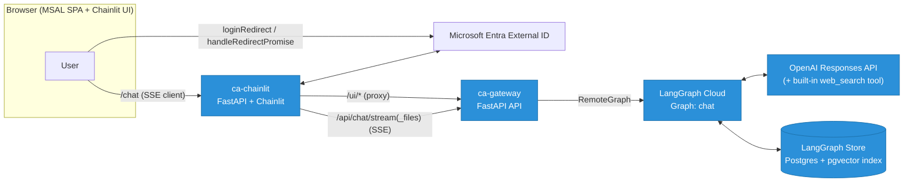
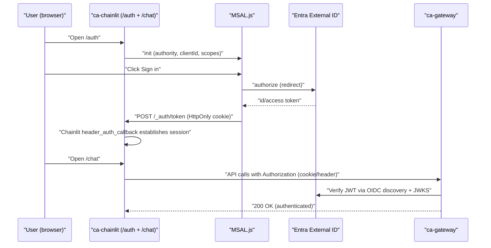
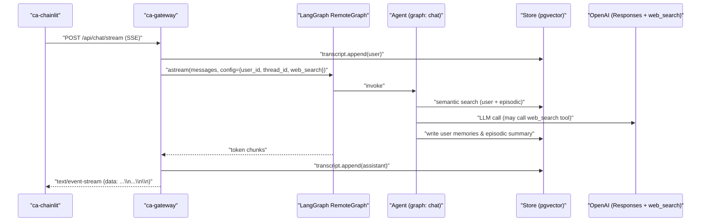

# End-to-End (Single Region, pgvector)

# PrynAI Chat — End‑to‑End Architecture (Single Region, PGVector Memory)

## Overview
  ### Goal:
  - Multi‑tenant, low‑latency chat app (Chainlit UI) with auth via Microsoft Entra External ID (CIAM), API Gateway, and a LangGraph‑hosted agent.

### High‑level:
- Browser (MSAL SPA) → Chainlit UI → Gateway (FastAPI) → LangGraph RemoteGraph → OpenAI (Responses + tools) + LangGraph Store (pgvector).

## Edge & Identity
- DNS (GoDaddy): CNAME chat.prynai.com → ACA public FQDN • Microsoft Entra External ID (CIAM): Google sign‑in → issues JWT

## Components

- ### Chainlit UI (ca-chainlit)
    - FastAPI server mounting Chainlit at /chat and static /auth SPA.
    - MSAL SPA: loginRedirect + handleRedirectPromise + acquireTokenSilent, posts to /_auth/token (HttpOnly cookie). Logout with logoutRedirect.
    - Chainlit header_auth_callback consumes cookie/Authorization header to create a session. 
    - Proxies /ui/* to Gateway for thread CRUD and utilities.
    - Web‑search toggle in Chat Settings (default off).
    - SSE client renders streamed tokens.

- ### Gateway (ca-gateway)
    - #### Auth:
        - Validates Bearer JWT (OIDC discovery + JWKS). Stores no secrets in browser storage beyond HttpOnly cookie
    - #### Chat streaming:
        - POST /api/chat/stream (SSE), POST /api/chat/stream_files (multipart + SSE).
        - Pre‑invoke input moderation; post‑stream output moderation (best‑effort).
        - Writes transcripts (user then assistant) to Store per thread.
        - Streams text/event-stream with spec‑compliant framing
    - #### Threads API:
       -  create/list/get/rename/delete with soft‑delete fallback.
    - #### Profile API:
       -  ensure/read/write user profile & settings.

 - ### Agent (LangGraph RemoteGraph: chat)
    - #### Web‑search feature flag:
       -  when enabled, LLM is bound to the OpenAI built‑in web_search tool using Responses API; can force a call on time‑sensitive queries.
    - #### Long‑term memory:
       - Retrieve: semantic search from LangGraph Store (pgvector) using an index declared in langgraph.json.
       - Write: (a) short durable “user” memories (structured extraction), (b) a 1‑line episodic summary after each turn.
   - #### Model:
       - OpenAI model via Responses API; temperature and reasoning profile tuned in code.
- ### Storage
   - #### LangGraph Store (Postgres + pgvector);
      -  vector index configured in deployment (embedding model + dims).
   - #### Namespaces:
      - ["users", <user_id>] → profile (settings).
      - ("users", <user_id>, "memories", "user" | "episodic") → memory items.
      - ["threads", <user_id>, <thread_id>] → transcript.
- ### Uploads
     - #### File limits:
        - count, bytes, extensions. Optional OCR. Converts to semantic context; never executes code/content.
      
## Request flows:
  ### Auth (SPA redirect) :
  - Browser → Entra (MSAL redirect) → returns tokens → SPA POSTs / _auth/token → Chainlit header auth → UI ready.
  ### Chat streaming (SSE)
  - UI → Gateway /api/chat/stream → RemoteGraph → Agent → (Store search, OpenAI, optional web_search) → stream back tokens → transcript write.
  ### Uploads
  - UI → Gateway /api/chat/stream_files (multipart) → extract → add ATTACHMENTS CONTEXT → same streaming path.

## Security:
  - ### Identity:
      - Entra External ID (CIAM) tokens; validate iss/aud/exp/signature.
  - ### Cookies:
      - HttpOnly, SameSite=Lax, Secure.
  - ### CORS:
      - narrow allow list at Gateway.
  - ### Moderation:
     - in/out to limit harmful content.
  - ### PII:
     - Durable transcripts and memories—document retention policy and user deletion flow.
   
## Deployment & scaling:
  - ### Azure Container Apps:
      - Two containers (ca-chainlit, ca-gateway) with minReplicas: 0 (scale‑to‑zero) and HTTP scale rules; discuss cold‑start trade‑off vs minReplicas: 1 for latency‑sensitive edge cases.
  - ### LangGraph Cloud:
      - Remote graph URL + Store provisioned with vector index (embeddings model + dims).
        
## Observability:
 - Structured logs at Gateway (req id, user id hash, thread id).
 - Response timing histograms; cold‑start counters.
 - moderation flags count.

## Configuration tables:
 - ### Chainlit UI:
    - GATEWAY_URL, COOKIE_DOMAIN, (optional) CHAINLIT_* for auth hooks.
- ### Gateway:
    - LANGGRAPH_URL, LANGGRAPH_GRAPH, OIDC_DISCOVERY_URL, OIDC_AUDIENCE, MODERATION_ENABLED, MODERATION_MODEL, CORS origins.
- ### Agent:
    - model names, embeddings model, memory toggles.
- ### Uploads:
    - size/limits, OCR backend + page cap.
 
## Known limitations:
 - First request after scale‑to‑zero incurs cold start.
 - No server‑side virus scanning on uploads (explicitly out of scope).
 - Memory is assistive, not authoritative; incorrect extractions can be edited/cleared.

 ## System / Containers
 

### Notes:
- UI auth via MSAL SPA + HttpOnly cookie → Chainlit header_auth_callback.
- Gateway streams SSE (spec‑compliant framing).
- Agent uses Responses API + built‑in web_search.
- Store provides semantic search across user/episodic memories

## Auth sequence

- #### MSAL SPA redirect + handleRedirectPromise and logout redirect; Chainlit header auth.

## Chat streaming + memory

- #### SSE framing standards; LangGraph Store semantic search.
