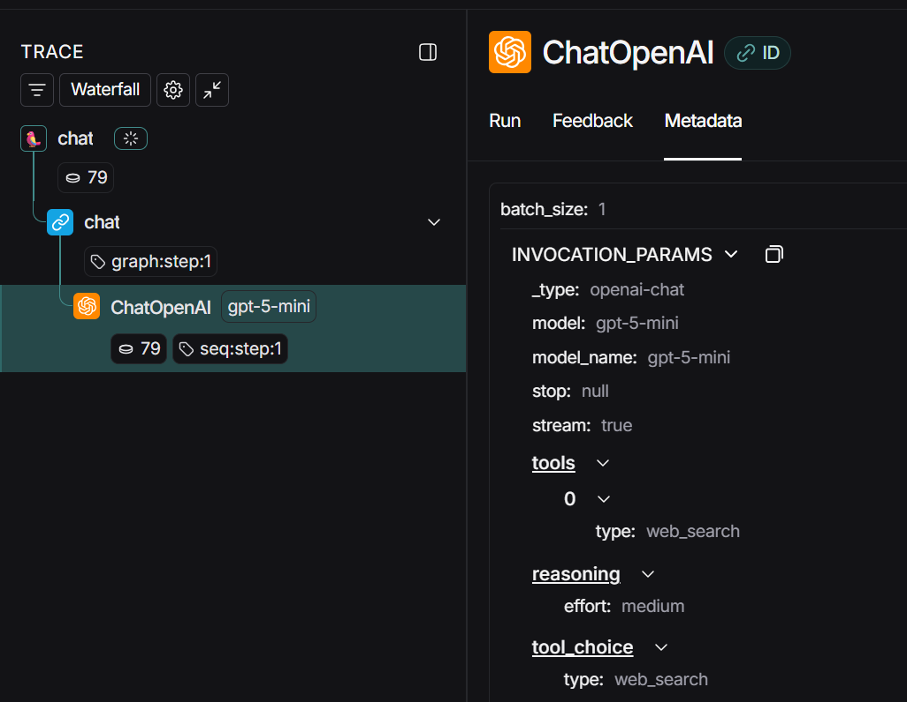

# OpenAI Web Search (UI toggle + agent tool)

- Status: Completed
- Scope:
    - Add a session‑level “Web search (OpenAI)” toggle in Chainlit, propagate the setting through the Gateway, and enable OpenAI’s built‑in web_search tool in the LangGraph agent. When the toggle is ON, the agent prepends a short system instruction and forces one call to the web_search tool for that turn; when OFF, no tool is available or used.

- OpenAI’s Web Search is exposed as a built‑in tool on the Responses API; the model performs web searches as part of tool‑use and returns results with citations/annotations.

## High‑level flow

### Chainlit UI:
- user flips Web search (OpenAI) in Chat Settings. When ON, the UI includes web_search: true in the chat request. 

### Gateway (FastAPI):
- forwards the flag to LangGraph as configurable.web_search. Streaming SSE remains unchanged.

## Agent (LangGraph Cloud):
- If the flag is ON, the node:
- Prepends a system tip instructing the model to browse for time‑sensitive facts.
- Binds the built‑in tool {"type":"web_search"} and forces at least one call via tool_choice="web_search". (This “force” behavior matches LangChain’s documented tool_choice controls.) 
- The request path continues to match the project’s single‑region architecture (Browser → Chainlit → Gateway → LangGraph).

### Repository changes (source layout)

- Agent (LangGraph Platform)

- my_agent/graphs/chat.py — calls the feature helper to choose LLM + prepend the system tip when enabled; forwards config to the model.

- my_agent/features/web_search.py — feature module implementing system instruction, tool binding, and tool_choice="web_search". Default model set to gpt-5-mini.

- langgraph.json — unchanged mapping to ./my_agent/graphs/chat.py:graph.

- Agent package/deps (Responses API + LangChain OpenAI) in pyproject.toml.

## Gateway (FastAPI)

- src/features/websearch.py — Pydantic model (ChatIn) and build_langgraph_config() that injects configurable.web_search.

- src/main.py — imports the feature module; streaming and moderation paths unchanged.

- Gateway deps in pyproject.toml.

## Chainlit UI

- src/settings_websearch.py — Chat Settings toggle, persisted in user session; helper to read current state.

- src/main.py — includes web_search in the POST payload; streaming UI unchanged.

- Chainlit deps in pyproject.toml.

## How it works (implementation details)

### Responses API + built‑in tool.
-   The agent runs with use_responses_api=True and binds OpenAI’s web_search tool when the session flag is ON. This is the supported path for model‑managed browsing and citations. 

### System instruction.
-  When enabled, the node prepends a concise system message: “You have access to the web_search tool… call web_search for current/time‑sensitive facts and include source URLs.”

### Force one tool call.
-  To guarantee browsing happens when enabled, we set tool_choice="web_search" via LangChain’s bind_tools, which forces at least one call to that tool on the turn. 

### UI settings.
- The toggle uses Chainlit’s Chat Settings; updates are delivered to the server and stored in user session. 

### Streaming path.
-  Gateway streams tokens from LangGraph to the browser via SSE (data: <chunk>\n\n), with input/output moderation unchanged.

## Validation tests

- OFF → no browsing. Toggle OFF and ask: “What is the current weather in London, UK?” Expect: no browsing and a recency disclaimer. you will see web_search=false in langsmith traces 

- ON → browsing forced. Toggle ON and ask the same. Expect: a web search call and sources in the answer. you will see tool call as "web_search" and web_search=true

## Known limitations

- Web Search returns webpage results; it isn’t a specialized vertical API (e.g., weather). You should state the retrieval time and cite URLs in answers. (OpenAI exposes citations/annotations in the Responses API when search is used.) 
OpenAI Platform

- Domain pinning/filters are not part of this MVP. Future work can add citation rendering from Responses annotations in the Gateway/UI.

## References

- OpenAI Web Search (built‑in tool) & Responses API: enablement and behavior. 
OpenAI Platform - https://platform.openai.com/docs/guides/tools-web-search?api-mode=responses 

- LangChain bind_tools & tool_choice (forcing a specific tool). 
[LangChain] https://python.langchain.com/api_reference/openai/chat_models/langchain_openai.chat_models.base.ChatOpenAI.html 

- Chainlit Chat Settings & user session. 
https://docs.chainlit.io/advanced-features/chat-settings 

